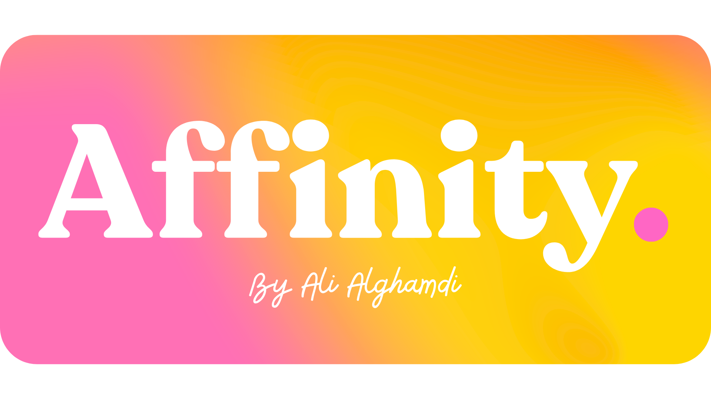

  

 

> *A classroom tool built for the Saudi English classroom. Designed with intention. Built with care.*

 

---

## What is Affinity English?

Affinity English is a **teacher-facing classroom presentation tool** built specifically for Saudi Arabian English classrooms — both public and private schools that teach the Mega Goal curriculum.

The premise is simple: the teacher opens Affinity, projects it onto the whiteboard, and the students see it. Students never touch the software themselves. It is designed entirely around the teacher's experience *in front of the class*, and the student's experience *looking at the board*.

It currently covers the full **Mega Goal 1** curriculum (both Part 1 and Part 2 — all 12 units), and its secondary features are useful in any English classroom regardless of book.

---

## The Vision

Saudi classrooms have a boredom problem. Not because students aren't curious — they are. But the tools teachers use don't speak their language. Slidedecks feel clinical. Whiteboards feel static. Nothing about the average classroom experience is designed to *earn* a student's attention.

Affinity English is built on a different assumption: **that beauty is functional**. That a student who is aesthetically engaged is a student who is paying attention. That color, motion, and personality in a classroom tool are not vanity — they are pedagogy.

This is not an AI product. It is not a productivity suite. It is a classroom companion — one that makes teachers feel capable, makes lessons feel alive, and gives students something worth looking at.

---

## The Serotonin Engine

At the heart of Affinity is something called the **Serotonin Engine** — a proprietary color system native to the app.

The app runs on **9 accent colors**: Red, Orange, Yellow, Lime, Teal, Cyan, Blue, Purple, and Pink. These are not random. Each color comes with its own curated set of secondary colors — for text colorization, for highlighted text, and for badged structures — all mathematically harmonious with the primary accent.

The colors are never static. In menus, a live animated sentence reads **"[Teacher's Name]'s [Adjective] Class"** — one of over 100 adjectives cycling on a caret. Every time the adjective changes, the entire app's color palette shifts to match the new accent. In content screens like grammar cards, vocab flashcards, and revision questions, the color shifts every time you move to the next item.

This is what makes Affinity look unlike anything else in an English classroom. The visual rhythm is constant but never jarring — always beautiful, always fresh, always *different enough* to keep eyes on the board. The font throughout is **Fredoka** — soft, rounded, bold, and unmistakably warm.

The Serotonin Engine is not just decoration. It is the backbone of how content is *rendered*. Grammar structures are **badged** (white text on a vivid color background, with small Arabic translations above each part). Key terms are **colorized** (shifted from off-black to the accent or its secondary colors). Important phrases are **highlighted** (a faint color wash behind the text, with the text itself matching the highlight tone). Every one of these rendering modes adapts fully to whichever accent color is currently active.

---

## Main Features

### 📖 Grammar Explainer

The Grammar section covers all 12 units of Mega Goal 1, split into Part 1 (Units 1–6) and Part 2 (Units 7–12). Each unit has two subsections: **Grammar** and **Form, Meaning & Function** — mirroring the structure of the book itself.

When you open a grammar lesson, you enter a card-by-card presentation. Each card is clean, white, and focused — intentionally small amounts of content per card rather than overwhelming walls of text. Cards include:

- **Badges** for grammatical structures (e.g. *Subject + Verb + Object*, with each component labelled in Arabic above it in a matching color badge)
- **Colorized and highlighted text** for key terms and rules
- **Arabic translations** beneath the English content, separated by a subtle divider
- A **typing caret animation** for example sentences — a small but meaningful detail that breaks the rhythm of passive reading
- Pagination, keyboard navigation (arrow keys / spacebar), and a progress indicator

The content is entirely original — written fresh, never pulled from the textbook — and every grammar point is translated into clear Arabic. This matters deeply: for Saudi students learning English as a second language, Arabic translation is not a crutch, it is a bridge. Affinity builds that bridge directly into the lesson.

Even a teacher who is uncertain about a grammar point can walk through these cards with full confidence. That is intentional.

---

### 📚 Vocabulary

The Vocabulary section organizes words from Mega Goal 1 into carefully curated sets: **thematic sets**, **reading passage sets**, **miscellaneous sets**, and the official **End of Unit vocabulary** that appears at the back of the book — the words most likely to appear on exams and in official question banks.

Every single word in every set is pulled verbatim from the book. Nothing is added, nothing is paraphrased. Saudi students are exam-minded, and they — and their teachers — will only engage seriously with vocabulary that appears explicitly in the curriculum.

When you open a vocab set, you enter a flipcard player. Each card shows a word. When you tap the card, it flips to reveal:

- **The Arabic meaning**, large and prominent, in a vivid colored box
- The **English word** and its part of speech
- A **definition** in English, with colorization and highlighting
- An **example sentence** with the target word colorized, typed by a caret animation
- **Synonyms**
- A **Tip** (where relevant) — important nuances, alternate meanings, or common confusions

Teachers can control the pace from settings: definitions, examples, and tips can each be hidden behind a "Reveal" button, letting the teacher prompt students before showing the answer.

The color shifts with every card, every time.

---

### ✏️ Revise

The Revise feature is a fully configurable **MCQ revision session** built for classroom use.

Teachers select: a **unit** (1–12), a **difficulty** (Easy / Medium / Hard / All), and a **question count** (1 to the full pool). There are 100 questions per unit, spanning grammar and vocabulary, with roughly a 25/50/25 split across difficulty tiers.

**Without a class selected**, questions cycle through the screen with color shifts, a progress bar, correct/wrong visual feedback (green and red), and a **"Why?"** button that reveals a plain-language explanation in Arabic for why the correct answer is right and the rest are wrong. A lightbulb hint appears after 10 seconds of inactivity. Teachers can use keyboard keys A/B/C/D — and a discreet spacebar shortcut silently selects the correct answer, so no teacher ever feels exposed by a question they don't know.

**With a class selected**, the feature becomes a **Star Challenge**. One question is assigned per student in the class. As each question appears, that student's name and profile appear in a badge on screen — their color, their chosen symbol, their name. When they answer correctly, a star animates from the answer choice and flies to their name with a particle trail, explodes on impact, and their badge glows with a shifting rainbow outline. The star level earned depends on the question difficulty:

| Difficulty | Star Earned |
|---|---|
| Easy | ⭐ Spark Star |
| Medium | 🔵 Shine Star |
| Hard | 💜 Radiant Star |
| Exceptional | 🌈 Resplendent Star |

Students earn stars. Stars mean something. And watching your name light up on the whiteboard is, frankly, unforgettable.

---

## Secondary Features

### 🧪 Lesson Lab

Accessible from the main screen's lower bar via the flask icon, the **Lesson Lab** is a lesson generation tool powered by **Gemini**.

A teacher fills in: a description of what they want to teach (up to 500 characters), a lesson name, and a lesson type. There are four types:

- **Explanation** — text-based content rendered exactly like the grammar cards
- **Questions** — MCQ questions rendered like the Revise player
- **Vocabulary** — flashcards rendered like the Vocab player
- **Mixed** — all three types blended into a single cohesive lesson

The generated lesson uses the full Serotonin Engine — badged structures, colorized text, highlighted phrases, Arabic labels — all produced automatically, all beautiful. Lessons are capped at around 25 items and typically generate in under 40 seconds.

Generated lessons are saved to a **Library** and can be replayed anytime. The Lab is not marketed as an "AI tool" inside the classroom experience — it is simply called the Lab, framed as a chemical reaction that brews your lesson. The choice is deliberate: teachers and students deserve a tool that earns trust on its own merits, not one that rides a label.

---

### 🖊️ Canvas

The **Canvas** is a purpose-built classroom whiteboard. Teachers type directly onto a large, clean surface using the full typographic system of the app — colorized text, highlights, badges, and a new addition: **underlines**.

The Canvas also features **8 callout types**, each color-coded and icon-tagged for instant student recognition:

| Callout | Color | Purpose |
|---|---|---|
| Vocabulary | Pink | New word |
| Grammar Rule | Purple | Rule or structure |
| Example | Cyan | Usage example |
| Tip | Yellow | Useful note |
| Pronunciation | Cyan | How to say it |
| Caution | Orange | Common mistake |
| Question | Red | Discussion prompt |
| Activity | Green | Classroom task — press "Done" for confetti 🎉 |

Canvases can be **saved and named** so teachers can prepare boards in advance and return to them anytime. The **AI Canvas** button lets teachers describe what they want on the whiteboard and have it generated instantly — complete with callouts, colorization, and structure.

This replaces Word, PowerPoint, and the default whiteboard with something that is *actually designed for a classroom* — legible from the back row, visually engaging, and fast to produce.

---

### 🌙 Idle Screens

Four full-screen animated displays teachers can activate whenever the moment calls for it — end of period, waiting time, or a classroom observation:

1. **Grammar Idle** — A caret writes a sentence onto the screen. A highlighter then marks 1–3 grammatical structures within it, each labeled below in a matching Serotonin color. 658 unique sentences. Endlessly cycling.

2. **Vocabulary Carousel** — The vocabulary flashcard player running automatically across all Mega Goal 1 words. Each card displays for ~5 seconds, flips to reveal its content, then the next card appears in a new color.

3. **Idioms** — The same carousel format, running through a collection of 200 English idioms. Not limited to Mega Goal — useful in any English classroom.

4. **Spot the Error** — A sentence appears. A wrong portion is highlighted in red. A caret returns and corrects it, turning it green. An explanation box appears below. Beautiful, instructive, and genuinely hard to look away from.

The mouse controls disappear when idle, leaving only the animation on screen.

---

### 🫁 Breathing

Three scientifically-grounded breathing exercises accessible from the main screen's lower bar:

- **Resonant Breathing**
- **Psychological Sigh**
- **Box Breathing**

Each plays for 5 minutes with a rich animated visual on a deep black background — a deliberate visual break from the rest of the app. A quiet acknowledgment that students are people, classrooms are stressful, and five minutes of intentional breathing does something nothing else on this list can.

---

## Students & Stars

The **Students** screen lets teachers build a roster of classes. Each student has:

- A **name**
- One of **9 accent colors**
- One of **63 symbols** (animals, science, nature, cosmos, sports, tech, objects, and more)

That's **567 distinct student profiles**. Students pick their own color and symbol — a small act of self-expression that matters more than it sounds.

Stars are awarded manually (by dragging them from the top bar onto a student card) or automatically through the Revise Star Challenge. Stars have four tiers, each with a distinct look.

**Reports** (certificates) can be generated per student or for an entire class at once — exported as a single merged PDF or a zipped collection. Each report is fully personalized: the student's color drives all colorization and highlighting on the certificate, their symbol appears prominently, and their stars are displayed exactly as earned. High-resolution, print-ready, and genuinely beautiful.

---

## Settings

- **Teacher name** — Personalizes the "[Name]'s [Adjective] Class" sentence throughout the app
- **Follow-along pointer** — A large, customizable cursor (small / medium / large) with a ripple click effect, in any of the 9 accent colors
- **Structured mode** — Locks the app to a single static color for teachers who prefer predictability or have students sensitive to motion
- **Color blindness modes** — Adapted palettes for all major types
- **Dyslexia-friendly fonts** — OpenDyslexic and Atkinson Hyperlegible
- **Class pace controls** — Toggle auto-reveal for definitions, examples, and tips in the Vocab player
- **Class management** — Add and delete classes from within settings
- **About** — The story behind the app and the Serotonin Engine, with a hidden easter egg that lets you see the engine's values side-by-side with and without its rendering applied

---

## Cloud Sync

Student data, classes, stars, and canvas saves are backed by **Supabase**. Teachers can upload their data from one device and download it on another — keeping everything intact across machines without complexity.

---

## Built With

- **React** — UI and component architecture
- **Gemini** — Lesson generation in the Lab and Canvas
- **Supabase** — Authentication and cloud data sync

---

 

  <em>Affinity English &copy; Ali Alghamdi. All rights reserved.</em> 
  <em>Version 0.0.1 Beta</em>

